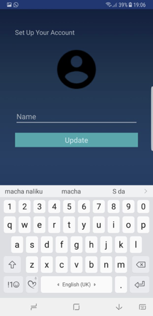
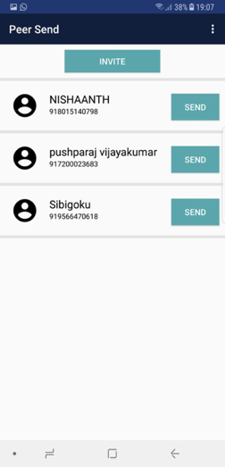
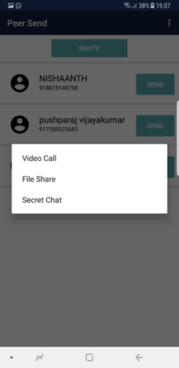
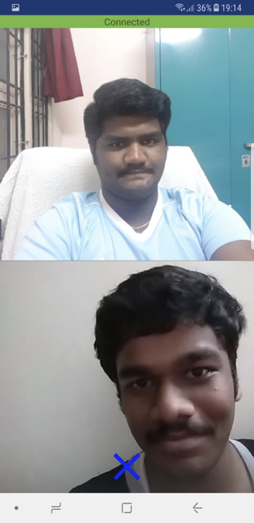
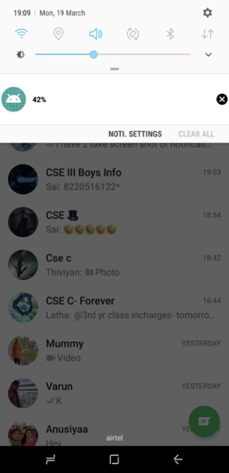
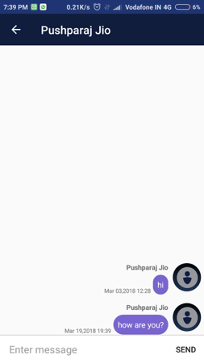

# PeerSend

PeerSend is an android application that provides the fetures of video calling , secret chatting and file sharing not over a centralized server but through a secur peer to peer connection. The application provides SMS OTP verification and syncs with the phone's contact list and shows the users of the application in the contact.

#### Note :

This is a work in progress we are still improving it's stability and code modularity. This note will be removed ones everything is finished

# Project developed by

1. K Nimal Manickam
1. P Nishaanth
1. K V Pushparaj

# Technical stack

1. WebRTC
    * WebRTC provides an android support library which is used to create peer to peer connections.
    * It is worth to note that webRTC in android has limited resources to learn and code in android.
    * We use it's media channel for video and audio calling.
    * File transfer and chat messages are sent over the data channel.

1. Firebase
    * We use firebase to authenticate the users and use it's realtime databse for just storing basic user details like name, phonenumber and google messaging token.
    * We use firebase's FCM(Firebase Cloud Messaging) service to send cloud messages to the call receivers to show them a ring.
    * Firebase's real time database has a feature to ad value event listeners. We used it kind of like a web socket to exchange session information duing signalling phase.
    * Firebase database and FCM are only used during the establishment of the peer to peer communication and no other user data is stored in any server.

# Application flow

1. Otp verification page
    
    In this page the user types in the phone number and an OTP is sent to the number which is then automatically detected by the application. This feature is fully built using firebase (Just an awesome abstraction).
    
    

1.  Name prompt

    The following page prompts for the name of the user.

    

1. Main page

    The main page of the application syncs the contacts of the user with the active users of the aplication and lists their names. It also consists of an invite button to invite other friends.

    

1. Options

    On clicking the send button we are provided with the following actions.

    

1. Video call

    The video call screen consists of a close button and shows tour camera feed on top and receiver's camera feed below.

    

1. File transfer

    The file transfer feature starts as a foreground service and takes the file transfer to the system status bar. This avoids the need to stay in the application in case of large file transfers.

    

1. Chat 

    The chat feature in PeerSend is different in a way that it establishes the the peer connection and on succefull connection ,we will encrypt each message that is sent. The screens in both sender and receiver are secure layouts and hence no screenshots or screen recordings can be taken. If a user jumps out of the chat, the other user will also loose all the chat data hence providing the concept of "Secret Chat"

      

